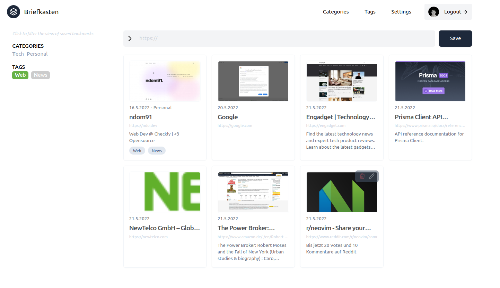

# 📮 Briefkasten

Self-hosted bookmarking application. WIP 👷



## 🚀 Getting Started

You'll need any type of database supported by Prisma, i.e. Postgresql, Mysql, etc. I've chosen [Planetscale](https://planetscale.com) for my implementation.

For OAuth support, you'll also need any one of the [providers](https://next-auth.js.org/providers) supported by [NextAuth.js](https://github.com/nextauthjs/next-auth).

1. Clone the repository

```sh
$ git clone git@github.com:ndom91/briefkasten.git && cd briefkasten
```

2. Install dependencies

```sh
$ npm install
```

3. Copy the `.env.example` file, and fill in your copy of the environment variables.

```sh
$ cp .env.example .env
$ vim .env
```

> For image cloud storage, I've decided to use [ImageKit](https://imagekit.io). They offer 20GB of storage and transformations and more in their free plan.

4. Start the development server!

```sh
$ npm run dev
```

## ⚙ Browser Extension

There is a companion browser extension in the works which you can use to add websites to your vault while browsing the web. It can be found at [ndom91/briefkasten-extension](https://github.com/ndom91/briefkasten-extension). It is currently not published on any of the Browser Extension Stores, but can be built locally and loaded as a development extension in any Chromium based browser. More details in that repository.

## 👷 Contributing

This project is open to any and all contributions! Please stick to the ESLint / Prettier settings and I'll be happy to take a look at your issue / PR 😀

## 📝 License

MIT
