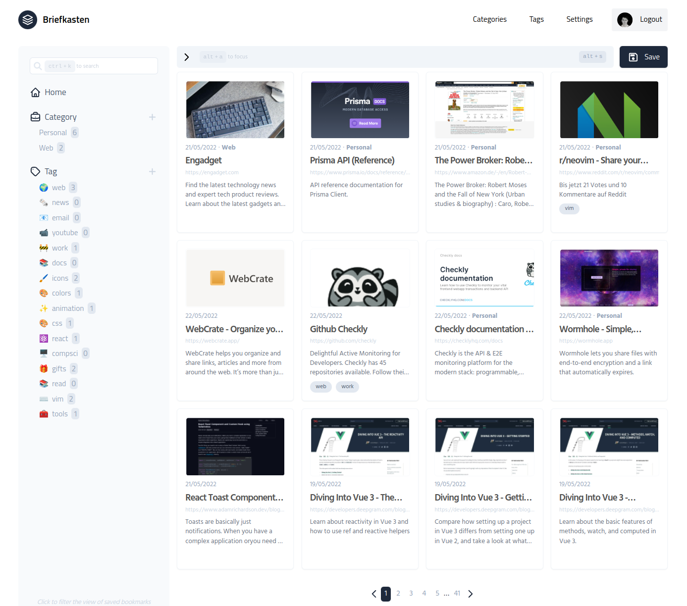

# 📮 Briefkasten


[](https://briefkasten.vercel.app)

Self-hosted bookmarking application. Works with any Prisma compatible database (MySQL, Postgres, etc.)!



## 🎩 Features

- Save by Browser Extension
- Keyboard Shortcuts
- Filter by Categories + Tags
- Search
- API
- OAuth Login
- Background Jobs

## 🧺 Prerequisites

To self-host this application, you'll need the following thins:

1. Server / hosting platform for a Next.js application (i.e. Vercel / Netlify)
2. For OAuth login, a developer account at any one of the [providers](https://next-auth.js.org/providers) supported by [NextAuth.js](https://github.com/nextauthjs/next-auth)
3. Database that works with Prisma (i.e. MySQL, Postgres, SQLite)
4. Image hosting space (i.e. ImageKit / Cloudinary)

These are all relatively straight forward, other than the image hoster. This was chosen to avoid putting the images in the database. The example application at [briefkasten.vercel.app](https://briefkasten.vercel.app) is using [ImageKit](https://imagekit.io), but any other similar provider like Cloudinary would also do the job. I chose ImageKit, because they have an easy to use SDK and a generous free tier - 20GB of storage, a CDN, image transformations, and more. I wanted to avoid using AWS, but a simple S3 Bucket would also work here. If you want to change the image hosting mechanism, it only takes a few lines of code in the `/src/pages/api/bookmarks/uploadImage.js` file.

After you've got an account setup at all of the above providers, or have your own infrastructure ready to go, you can continue on to the next steps below.

## 🚀 Getting Started

1. Clone the repository

```sh
$ git clone git@github.com:ndom91/briefkasten.git && cd briefkasten
```

2. Install dependencies

```sh
$ npm install
```

3. Copy the `.env.example` file, and fill in your copy of the environment variables.

```sh
$ cp .env.example .env
$ vim .env
```

In this environment variables file, make sure to fill in any of the keys / secrets needed for the cloud providers you selected for the components above.

4. Start the server!

```sh
// dev
$ npm run dev

// prod
$ npm run build
$ npm start
```

## 🕸 Related


### 🌍 Browser Extension

There is a companion browser extension in the works which you can use to add websites to your vault while browsing the web. It can be found at [`ndom91/briefkasten-extension`](https://github.com/ndom91/briefkasten-extension). It is currently not published on any of the Browser Extension Stores, but can be built locally and loaded as a development extension in any Chromium based browser. More details in that repository.

### 🧑‍🏭 Screenshot Job

There is also a background job to fill in bookmarks which do not have a valid image. It can be found in the [`ndom91/briefkasten-scrape`](https://github.com/ndom91/briefkasten-scrape) repository. This job runs every 3 hours in a Github Action and processes 5 bookmarks at a time.

## 👷 Contributing

This project is open to any and all contributions! Please stick to the ESLint / Prettier settings and I'll be happy to take a look at your issue / PR 😀

## 📝 License

MIT
